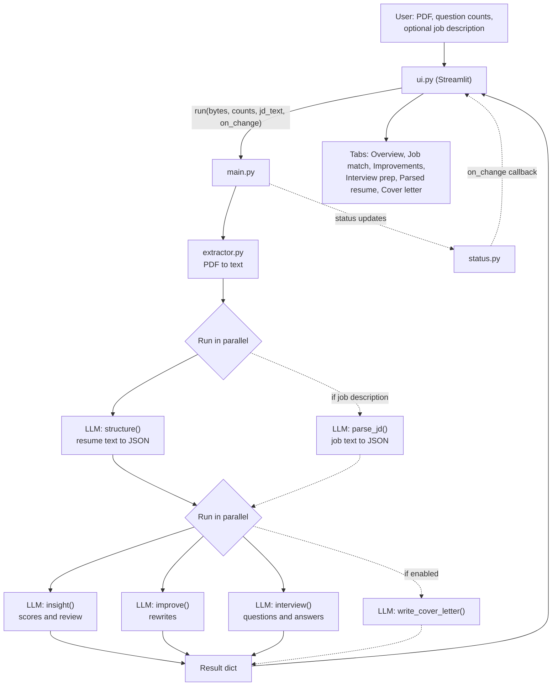
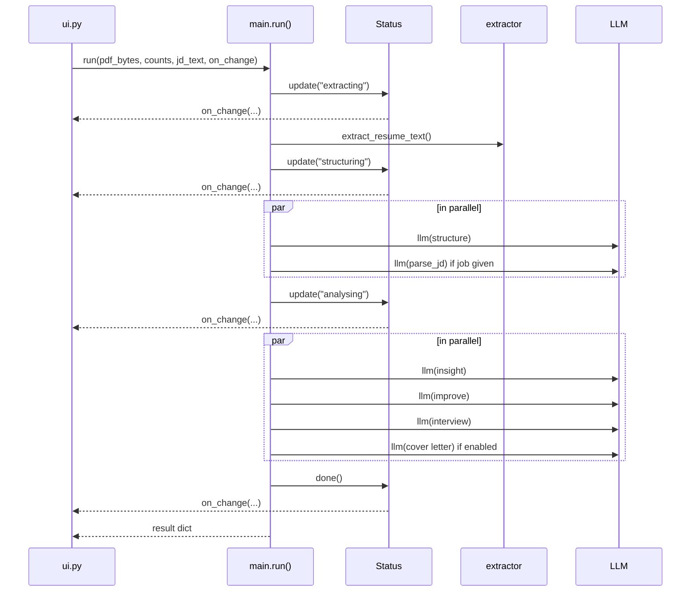

# ResumeForce AI

**Live demo:** [resumeforce-ai.streamlit.app](https://resumeforce-ai-ls6qbxft4htnhhzwi99osn.streamlit.app)

Upload a resume PDF and get a scored review, rewritten bullets, tailored interview prep and an optional cover letter in one pass. Add a job description to tailor everything to a specific role. Built with Python, Streamlit and an LLM served through Ollama.

## What it does

- **Parses** the PDF into clean structured JSON (contact details, skills, experience, projects, education and more).
- **Scores** the resume: overall quality, ATS readiness, per-section scores, strengths, weaknesses, red flags, missing keywords and suggested roles.
- **Rewrites** the summary, skills and bullets without inventing facts, and lists the details only you can add (metrics, links, results).
- **Generates interview prep**: technical, project, behavioral and HR questions with short model answers written from your resume. You choose how many of each.
- **Matches a job description** (optional): match score, matched and missing skills, experience gaps, and job-aware rewrites and questions.
- **Writes a cover letter** (optional): editable in the app and downloadable as `.txt` or a styled `.docx`.

## Quick start

**Requirements:** Python 3.10+ and an Ollama API key.

```bash
git clone <repo-url>
cd resumeforce
pip install -r requirements.txt
```

Create a `.env` file in the project root:

```env
OLLAMA_API_KEY=your_key_here
```

Run the app:

```bash
streamlit run ui.py
```

`requirements.txt`:

```text
streamlit>=1.36
pymupdf
ollama
python-dotenv
python-docx
```

On Streamlit Cloud, add `OLLAMA_API_KEY` under **Secrets** instead of using a `.env` file.

## Project structure

```text
resumeforce/
├── ui.py            # Streamlit front end (inputs, progress, result tabs)
├── main.py          # Central system: wires every module into one pipeline
├── extractor.py     # PDF -> plain text (+ embedded hyperlinks)
├── LLM.py           # Ollama client, JSON mode, retry, safe JSON parsing
├── prompts.py       # Output schemas and the prompt builders
├── docx_letter.py   # Builds the styled Word cover letter
├── status.py        # Pipeline progress tracker with a change callback
├── icon.png         # App icon, loaded by ui.py on start
├── .env             # OLLAMA_API_KEY (not committed)
└── requirements.txt
```

## How it works

### The big picture

`main.py` is the only module that knows the order of the pipeline. The UI never calls the LLM or the extractor directly. It calls `main.run()` and renders whatever comes back.



Dotted lines are optional. They only run when the user supplies a job description or turns on the cover letter.

### Pipeline step by step

1. **Extract** (`extractor.py`). PyMuPDF reads the PDF (from a path or raw upload bytes). Text is pulled page by page with `sort=True` so reading order is preserved, and every hyperlink found in the PDF is appended under a `Links:` section so URLs hidden behind link text (LinkedIn, GitHub, portfolio) are not lost. If no text is found, it raises a clear error because the file is probably a scanned image.

2. **Structure** (`structure()` and `parse_jd()` prompts). The raw resume text goes to the LLM with a strict parsing prompt: use only what is explicitly in the resume, keep dates, names and numbers exactly as written, and fill missing fields with `""` or `[]`. If a job description was pasted (trimmed to 6,000 characters), it is parsed into JSON at the same time. The outputs match `STRUCTURE_SCHEMA` and `JD_SCHEMA`.

3. **Analyse** (three or four prompts, in parallel). Every prompt works from the structured JSON rather than the raw text, so they see clean, consistent input. They are independent, so `main.analyse()` runs them at the same time in a `ThreadPoolExecutor`. The calls are network-bound, so threads work well here. When a job is present, each prompt also receives it as a `TARGET JOB` block.

   | Prompt | Output schema | Purpose |
   |---|---|---|
   | `insight()` | `INSIGHT_SCHEMA` | Scores, strengths, weaknesses, red flags, missing keywords, suggested roles, job match |
   | `improve()` | `IMPROVE_SCHEMA` | Rewritten summary, skills, bullets and a priority action list |
   | `interview()` | `INTERVIEW_SCHEMA` | Questions and short first-person answers per topic (skipped if every count is 0) |
   | `write_cover_letter()` | `COVER_LETTER_SCHEMA` | Subject, greeting, paragraphs, sign-off (only if enabled) |

4. **Return**. `run()` returns one dict:

   ```python
   {
       "structured": {...},          # parsed resume
       "report": {...},              # insights, scores, job_match
       "better": {...},              # improvements
       "questions": {...},           # interview prep
       "jd": {...} | None,           # parsed job description
       "jd_error": str | None,       # set if the job text could not be read
       "cover_letter": {...} | None,
       "cover_letter_error": str | None,
   }
   ```

   The Streamlit UI keeps this dict in `st.session_state["result"]` so the page survives reruns such as tab switches or downloads.

5. **Render** (`ui.py`). Results appear as tabs. Some only exist when relevant.

   | Tab | Shown when |
   |---|---|
   | Overview | Always |
   | Job match | A job description was parsed |
   | Improvements | Always (with an original vs improved toggle) |
   | Interview prep | Always |
   | Parsed resume | Always |
   | Cover letter | The cover letter toggle was on and it succeeded |

   The full result can also be downloaded as JSON.

### Cover letter flow

The model returns the letter as structured JSON. The UI joins it into plain text and shows it in an editable box. When the user downloads it, `docx_letter.py` splits the (possibly edited) text back into greeting, body paragraphs and sign-off and builds a Word file with the candidate's name, a clickable contact line (email, phone, location, up to two links), the date, the company, and the subject. Details the model could not know (a metric, a link) are listed under **Make it stronger** instead of being invented.

### Module responsibilities

| Module | Responsibility | Notes |
|---|---|---|
| `ui.py` | Collects inputs, shows live progress, renders results | Only built-in Streamlit widgets plus a small CSS block. Reads model output defensively with `.get` and type checks, so a slightly off response does not crash the page. |
| `main.py` | Orchestrates the pipeline | Exposes `run()` and `analyse()`. Wraps the optional parts so their failures do not stop the run. |
| `extractor.py` | PDF text and link extraction | Accepts a file path or `bytes`. |
| `LLM.py` | Talks to the model | See below. |
| `prompts.py` | Schemas and prompt text | Each prompt embeds its schema and a numbered rule list. Question counts are clamped to 0 to 20 by `normalize_count()`. |
| `docx_letter.py` | Word cover letter export | Calibri, teal accent, hyperlinks for email, phone and profile links. |
| `status.py` | Progress tracking | Stores the current step and a history. Fires `on_change(current)` on every update. |

### LLM layer (`LLM.py`)

- Connects to `https://ollama.com` with a bearer token read from `.env` or from Streamlit secrets. The app fails fast with a readable message if `OLLAMA_API_KEY` is missing.
- Uses JSON mode (`format="json"`) and `temperature=0` for consistent, repeatable output.
- A system prompt reinforces "valid JSON only".
- **Retry:** one retry after 2 seconds on `ResponseError` or `ConnectionError`.
- **Safe parsing:** `parse()` takes the text between the first `{` and the last `}` to strip any stray text, then calls `json.loads`. If the model stopped because it hit the token limit, the error says the output was cut off. It also checks that the result is a JSON object.
- The model is set by the `MODEL` constant (default `gemma4:31b`). Change it there.

### Progress reporting

`Status` is created inside `run()` and receives the UI's `on_change` callback. Each stage (`extracting`, `structuring`, `analysing`, then `done` or `failed`) triggers the callback, and the UI updates its `st.status` box. The callback runs on the calling thread. Only the LLM calls run in worker threads, so Streamlit calls stay thread-safe.



On any fatal exception, `run()` calls `status.fail(error)` and re-raises, and the UI shows the error message.

## Design decisions

- **Structure first, analyse second.** Parsing once into a fixed schema gives the later prompts consistent input and keeps them shorter. The job description gets the same treatment.
- **No invented facts.** Every prompt forbids made-up metrics, tools, employers or results. When a bullet or letter would benefit from a number or link only the user has, the model puts an instruction in `add_these_yourself` instead.
- **Honest about gaps.** With a job description, missing required skills are reported as gaps. Rewrites, interview answers and the cover letter must not claim them and use the closest real experience instead.
- **One schema per prompt.** The schema is embedded in each prompt and the model is told not to add extra keys, which keeps the JSON predictable for the UI.
- **Honest ATS score.** With no job description, `ats_score` is a general readiness estimate. With one, it measures fit to that job.
- **Optional parts fail soft.** A bad job description falls back to a general review, and a failed cover letter shows a warning. Neither blocks the main results.
- **UI stays thin.** Because all orchestration lives in `main.py`, you can swap the front end (CLI, API, another UI) without touching the pipeline.

## Extending the project

To add a new analysis (for example, a LinkedIn "About" section):

1. Add a schema and a prompt builder in `prompts.py`.
2. Add the call in `main.analyse()`. Use `_try` like the cover letter if it should not fail the whole run, and include its result in the dict returned by `run()`.
3. Add a `show_...()` function and a tab in `ui.py`.

To change the model or provider, edit `LLM.py`. The rest of the code only expects `llm(prompt) -> dict`.

## Limitations

- **Scanned PDFs are not supported.** There is no OCR, so image-only resumes are rejected.
- **LLM output can vary.** Scores are model judgments, not ground truth. Use them as guidance.
- **Retries are limited.** The client retries once on network or API errors. Invalid JSON from the model is not retried and surfaces as an error.
- **Core steps are all-or-nothing.** If resume structuring, insights, improvements or interview generation fails, the whole run fails. Only the job description and cover letter are optional.
- **Job descriptions are capped** at 6,000 characters.
- **Edit, then commit.** In the cover letter box, press Ctrl+Enter or click outside before downloading so the edit is included.

## Privacy

The text of your resume and any job description you paste are sent to the configured Ollama endpoint for processing. Nothing is stored by this app beyond the current Streamlit session. Review your provider's data policy before uploading sensitive documents.
