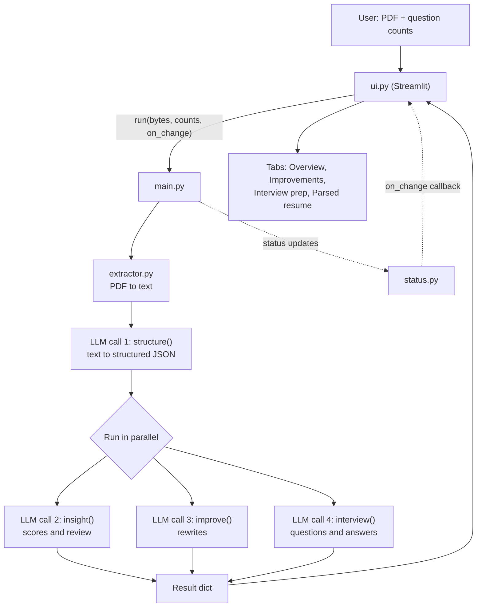
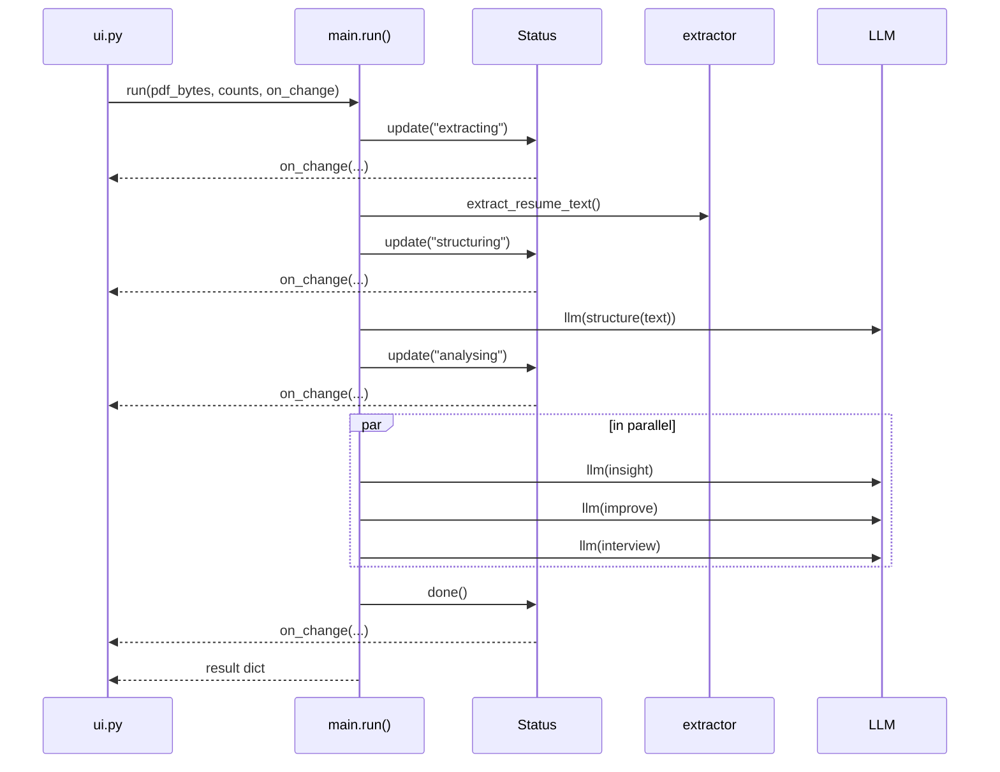

# ResumeForce AI

Upload a resume PDF and get a scored review, rewritten bullets and tailored interview prep in one pass. Built with Python, Streamlit and an LLM served through Ollama.

## What it does

- **Parses** the PDF into clean structured JSON (contact details, skills, experience, projects, education and more).
- **Scores** the resume: overall quality, ATS readiness, per-section scores, strengths, weaknesses, red flags, missing keywords and suggested roles.
- **Rewrites** the summary, skills and bullets without inventing facts, and lists the details only you can add (metrics, links, results).
- **Generates interview prep**: technical, project, behavioral and HR questions with short model answers written from your resume. You choose how many of each.

## Quick start

**Requirements:** Python 3.10+ and an Ollama API key.

```bash
git clone <repo-url>
cd resumeforce
pip install -r requirements.txt
```

Create a `.env` file in the project root:

```env
OLLAMA_API_KEY=your_key_here
```

Run the app:

```bash
streamlit run ui.py
```

Or run the pipeline from the command line (reads `test.pdf` in the project root):

```bash
python main.py
```

`requirements.txt`:

```text
streamlit>=1.36
pymupdf
ollama
python-dotenv
```

## Project structure

```text
resumeforce/
├── ui.py          # Streamlit front end (inputs, progress, result tabs)
├── main.py        # Central system: wires every module into one pipeline
├── extractor.py   # PDF -> plain text (+ embedded hyperlinks)
├── LLM.py         # Ollama client, JSON mode, retry, safe JSON parsing
├── prompts.py     # Output schemas and the four prompt builders
├── status.py      # Pipeline progress tracker with a change callback
├── .env           # OLLAMA_API_KEY (not committed)
└── requirements.txt
```

## How it works

### The big picture

`main.py` is the only module that knows the order of the pipeline. The UI never calls the LLM or the extractor directly. It calls `main.run()` and renders whatever comes back.



### Pipeline step by step

1. **Extract** (`extractor.py`). PyMuPDF reads the PDF (from a path or raw upload bytes). Text is pulled page by page with `sort=True` so reading order is preserved, and every hyperlink found in the PDF is appended under a `Links:` section so URLs hidden behind link text (LinkedIn, GitHub, portfolio) are not lost. If no text is found, it raises a clear error because the file is probably a scanned image.

2. **Structure** (`structure()` prompt). The raw text goes to the LLM with a strict parsing prompt: use only what is explicitly in the resume, keep dates, names and numbers exactly as written, and fill missing fields with `""` or `[]`. The output matches `STRUCTURE_SCHEMA`.

3. **Analyse** (three prompts, in parallel). All three work from the structured JSON rather than the raw text, so they see clean, consistent input. They are independent, so `main.analyse()` runs them at the same time in a `ThreadPoolExecutor`. The calls are network-bound, so threads work well here.

   | Prompt | Output schema | Purpose |
   |---|---|---|
   | `insight()` | `INSIGHT_SCHEMA` | Scores, strengths, weaknesses, red flags, missing keywords, suggested roles |
   | `improve()` | `IMPROVE_SCHEMA` | Rewritten summary, skills, bullets and a priority action list |
   | `interview()` | `INTERVIEW_SCHEMA` | Questions and short first-person answers per topic |

4. **Return**. `run()` returns one dict:

   ```python
   {
       "structured": {...},  # parsed resume
       "report":     {...},  # insights and scores
       "better":     {...},  # improvements
       "questions":  {...},  # interview prep
   }
   ```

   The Streamlit UI keeps this dict in `st.session_state["result"]` so the page survives reruns such as tab switches or the JSON download.

### Module responsibilities

| Module | Responsibility | Notes |
|---|---|---|
| `ui.py` | Collects inputs, shows live progress, renders results | Only built-in Streamlit widgets plus a small CSS block. Reads model output defensively with `.get` and type checks, so a slightly off response does not crash the page. |
| `main.py` | Orchestrates the pipeline | Exposes `run()` and `analyse()`. Skips the interview call if every question count is 0. |
| `extractor.py` | PDF text and link extraction | Accepts a file path or `bytes`. |
| `LLM.py` | Talks to the model | See below. |
| `prompts.py` | Schemas and prompt text | Each prompt embeds its schema and a numbered rule list. Question counts are clamped to 0 to 20 by `normalize_count()`. |
| `status.py` | Progress tracking | Stores the current step and a history. Fires `on_change(current)` on every update. |

### LLM layer (`LLM.py`)

- Connects to `https://ollama.com` with a bearer token loaded from `.env`. The app fails fast with a readable message if `OLLAMA_API_KEY` is missing.
- Uses JSON mode (`format="json"`) and `temperature=0` for consistent, repeatable output.
- A system prompt reinforces "valid JSON only".
- **Retry:** one retry after 2 seconds on `ResponseError` or `ConnectionError`.
- **Safe parsing:** `parse()` takes the text between the first `{` and the last `}` to strip any stray text, then calls `json.loads`. If the model stopped because it hit the token limit, the error says the output was cut off. It also checks that the result is a JSON object.
- The model is set by the `MODEL` constant (default `gemma4:31b`). Change it there.

### Progress reporting

`Status` is created inside `run()` and receives the UI's `on_change` callback. Each stage (`extracting`, `structuring`, `analysing`, then `done` or `failed`) triggers the callback, and the UI updates its `st.status` box. The callback runs on the main thread. Only the LLM calls run in worker threads, so Streamlit calls stay thread-safe.



On any exception, `run()` calls `status.fail(error)` and re-raises, and the UI shows the error message.

## Design decisions

- **Structure first, analyse second.** Parsing once into a fixed schema gives the later prompts consistent input and keeps them shorter.
- **No invented facts.** Every prompt forbids made-up metrics, tools, employers or results. When a bullet would benefit from a number or link only the user has, the model puts an instruction in `add_these_yourself` instead.
- **One schema per prompt.** The schema is embedded in each prompt and the model is told not to add extra keys, which keeps the JSON predictable for the UI.
- **Honest ATS score.** With no job description, `ats_score` is a general readiness estimate, not a job-specific match.
- **UI stays thin.** Because all orchestration lives in `main.py`, you can swap the front end (CLI, API, another UI) without touching the pipeline.

## Extending the project

To add a new analysis (for example, a cover letter draft):

1. Add a schema and a prompt builder in `prompts.py`.
2. Add the call to the `prompts` list in `main.analyse()` and include its result in the dict returned by `run()`.
3. Add a `show_...()` function and a tab in `ui.py`.

To change the model or provider, edit `LLM.py`. The rest of the code only expects `llm(prompt) -> dict`.

## Limitations

- **Scanned PDFs are not supported.** There is no OCR, so image-only resumes are rejected.
- **LLM output can vary.** Scores are model judgments, not ground truth. Use them as guidance.
- **Retries are limited.** The client retries once on network or API errors. Invalid JSON from the model is not retried and surfaces as an error.
- **One failure fails the run.** If any of the parallel analysis calls fails, the whole analysis fails.
- **No job-description matching** yet.

## Privacy

The text of your resume is sent to the configured Ollama endpoint for processing. Nothing is stored by this app beyond the current Streamlit session. Review your provider's data policy before uploading sensitive documents.
